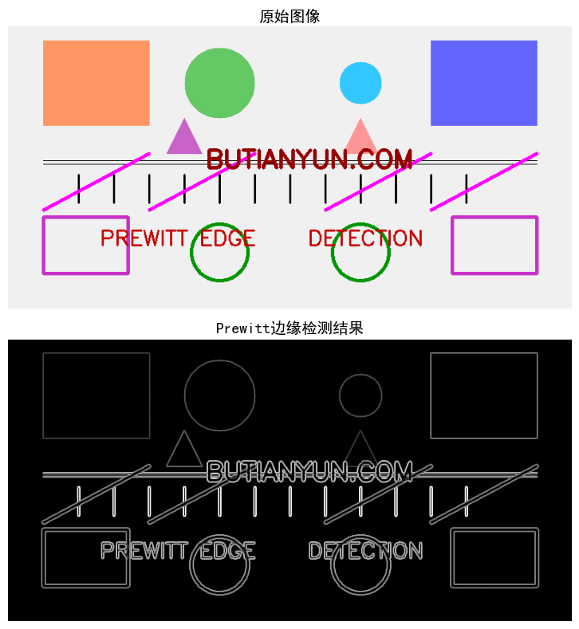

# 边缘检测Prewitt算法


[TOC]

## 前言

边缘检测作为图像处理的重要技术之一，其核心在于识别图像中灰度值发生急剧变化的位置。这些变化通常对应着物体的边界、纹理变化或光照差异等关键信息。Prewitt算子是一种经典的边缘检测方法，通过计算图像梯度的近似值来定位边缘。与Sobel算子相比，Prewitt算子采用了均匀权重的卷积核结构。


---
<center>
<p>
计算机视觉技术算法 概念+原理+实现
</p>
<p>
微信视频号：计算机视觉技术
</p>
<p>
微信公众号：计算机视觉技术
</p>
</center>

<center>


</center>

<center>


</center>

<center>


</center>


<center>
感谢您的关注！
</center>

---


## 概念

Prewitt算子是一种基于离散微分算子的边缘检测方法，其核心思想是计算图像灰度函数的梯度。梯度是一个向量，其方向指向灰度变化最快的方向，而梯度的幅值表示灰度变化的强度。在图像中，边缘处的灰度值变化剧烈，因此梯度幅值较大，而平滑区域的梯度幅值较小。Prewitt算子利用这一特性，通过计算图像中每个像素点的梯度幅值来识别边缘。与Sobel算子相比，Prewitt算子使用均匀权重的卷积核，对图像中的每个邻域像素给予相同的权重，这使得Prewitt算子在处理具有均匀特征的图像时表现更为稳定。

## 原理

Prewitt算子的核心是使用两个3×3的卷积核来分别计算图像在水平方向和垂直方向的梯度近似值。这两个卷积核分别对图像的水平和垂直边缘敏感，且采用了均匀的权重分配。

水平方向的Prewitt卷积核Gx用于检测垂直边缘，其定义为：
```
-1  0  1
-1  0  1
-1  0  1
```
该核的左右两侧权重符号相反且数值相等，中心列的权重为零，能够响应图像在水平方向上的灰度变化。与Sobel算子不同，Prewitt算子对上下三行的权重是相同的，没有对中心行进行加权处理。

垂直方向的Prewitt卷积核Gy用于检测水平边缘，其定义为：
```
-1  -1  -1
 0   0   0
 1   1   1
```
该核的上下两侧权重符号相反且数值相等，中心行的权重为零，能够响应图像在垂直方向上的灰度变化。同样，Prewitt算子对左右三列的权重是相同的。

对于图像中的每个像素点，分别用Gx和Gy对其邻域进行卷积运算，得到水平梯度分量Gx(x,y)和垂直梯度分量Gy(x,y)。然后通过计算梯度幅值来综合两个方向的梯度信息：
```
G(x,y) = √[Gx(x,y)² + Gy(x,y)²]
```

为了简化计算，也可以使用梯度幅值的近似形式：
```
G(x,y) ≈ |Gx(x,y)| + |Gy(x,y)|
```

梯度幅值较大的像素点通常位于边缘位置，通过设置适当的阈值，可以将这些边缘像素从背景中分离出来。

## 步骤

Prewitt边缘检测算法的实现步骤如下：

* 图像灰度转换：如果输入图像是彩色图像，首先将其转换为灰度图像。灰度转换通过加权平均的方式实现，常用的权值为：灰色 = 0.299×红色 + 0.587×绿色 + 0.114×蓝色。这一步消除了颜色信息，保留了亮度信息。

* 图像边缘填充：为了处理图像边界上的像素，需要在图像周围进行填充。这里采用镜像填充方式，用图像边缘的镜像值填充边界，这样可以减少边缘伪影。

* 水平梯度计算：使用水平Prewitt卷积核Gx对填充后的图像进行卷积运算，得到每个像素点的水平梯度分量。卷积运算将卷积核与图像中每个3×3的邻域进行对应元素相乘并求和。

* 垂直梯度计算：使用垂直Prewitt卷积核Gy对填充后的图像进行卷积运算，得到每个像素点的垂直梯度分量。

* 梯度幅值计算：对于每个像素点，根据水平梯度分量和垂直梯度分量计算该点的梯度幅值。梯度幅值反映了该位置灰度变化的强度。

* 图像归一化：将梯度幅值图像归一化到0-255的范围内，以便于显示和保存。归一化通过线性变换实现。

* 边缘图像输出：输出最终的边缘检测结果图像，其中边缘像素呈现较高的灰度值，而非边缘像素呈现较低的灰度值。

## 效果



从上面的对比图像可以看出，Prewitt边缘检测算法能够有效地从测试图像中提取出边缘信息。原始图像中包含多种几何形状（矩形、圆形、三角形）和线条元素，这些元素都具有清晰的边界特征。经过Prewitt边缘检测处理后，这些形状的边界被准确地识别出来，形成了连续的边缘线。

矩形和圆形的边缘呈现出完整且清晰的轮廓，三角形的三条边也被正确检测。横向和纵向的线条被识别为明显的边缘，斜线的边缘同样得到了良好的响应。文字部分的笔画边缘也被提取出来，但由于文字笔画的宽度较细，边缘检测的结果表现为细线。整体而言，Prewitt算子对图像中的各种边缘类型都有良好的响应能力。

Prewitt算子使用均匀权重的卷积核，在处理具有均匀特征的边缘时表现稳定。由于卷积核的权重分布均匀，Prewitt算子对图像中的噪声具有一定的抑制作用，但同时也可能导致边缘检测结果的平滑程度较高。与Sobel算子相比，Prewitt算子检测到的边缘线可能略宽一些，这是由于均匀权重对周围像素的影响相对均匀所致。

## 生成测试图片源码

生成测试图片的程序首先创建一个空白画布，然后在画布上绘制多种几何形状和文本元素。程序包括图像创建、矩形绘制、圆形绘制、线条绘制、文本绘制和多边形绘制等基本功能。

图像创建函数生成指定高度和宽度的空白图像，可以设置背景颜色。矩形绘制函数在指定位置绘制填充或空心的矩形。圆形绘制函数在指定中心位置绘制填充或空心的圆形。线条绘制函数在两个端点之间绘制直线。文本绘制函数在指定位置绘制文本，可以设置字体大小、颜色和粗细。多边形绘制函数根据给定的顶点坐标绘制填充的多边形。

主函数按照预定的布局依次绘制各种元素，包括背景矩形、圆形、三角形、横线和竖线、斜线、圆环、空心矩形和文本等。所有元素的位置都经过精心安排，确保文本之间保持适当距离，避免重叠现象。底部文本"BUTIANYUN.COM"位于距离底部200像素的位置。最终生成的图像包含丰富的边缘信息，适合用于展示Prewitt边缘检测算法的效果。

```python
# 本程序生成用于展示Prewitt边缘检测算法效果的测试图片。
# 测试图片包含多种几何形状和文本元素，这些元素具有明显的边缘特征，
# 能够有效展示Prewitt算子在边缘检测方面的性能。
# 程序创建了一个高度为400像素的彩色图像，其中包含圆形、矩形、线条和文本等元素，
# 所有元素都经过精心布局以确保文本之间保持适当距离，避免重叠现象。


############################################################
#   微信公众号：计算机视觉技术
#   微信视频号：计算机视觉技术
#   网站         ：BUTIANYUN.COM
############################################################


import numpy as np
import cv2

def butianyun_create_blank_image(height, width, color=(255, 255, 255)):
    """创建空白图像"""
    image = np.full((height, width, 3), color, dtype=np.uint8)
    return image

def butianyun_draw_rectangle(image, x, y, width, height, color, thickness=-1):
    """在图像上绘制矩形"""
    pt1 = (x, y)
    pt2 = (x + width, y + height)
    cv2.rectangle(image, pt1, pt2, color, thickness)
    return image

def butianyun_draw_circle(image, center_x, center_y, radius, color, thickness=-1):
    """在图像上绘制圆形"""
    center = (center_x, center_y)
    cv2.circle(image, center, radius, color, thickness)
    return image

def butianyun_draw_line(image, pt1, pt2, color, thickness):
    """在图像上绘制线条"""
    cv2.line(image, pt1, pt2, color, thickness)
    return image

def butianyun_draw_text(image, text, position, font_scale, color, thickness, font_type):
    """在图像上绘制文本"""
    cv2.putText(image, text, position, font_type, font_scale, color, thickness)
    return image

def butianyun_draw_polygon(image, points, color, thickness=-1):
    """在图像上绘制多边形"""
    pts = np.array(points, np.int32)
    pts = pts.reshape((-1, 1, 2))
    cv2.fillPoly(image, [pts], color)
    return image

def butianyun_generate_test_image():
    """生成测试图片"""
    image_height = 400
    image_width = 800
    image = butianyun_create_blank_image(image_height, image_width, (240, 240, 240))
    
    # 绘制背景矩形
    butianyun_draw_rectangle(image, 50, 20, 150, 120, (100, 150, 255), -1)
    butianyun_draw_rectangle(image, 600, 20, 150, 120, (255, 100, 100), -1)
    
    # 绘制圆形
    butianyun_draw_circle(image, 300, 80, 50, (100, 200, 100), -1)
    butianyun_draw_circle(image, 500, 80, 30, (255, 200, 50), -1)
    
    # 绘制三角形
    triangle_points = [(225, 180), (275, 180), (250, 130)]
    butianyun_draw_polygon(image, triangle_points, (200, 100, 200), -1)
    
    # 绘制另一个三角形
    triangle_points2 = [(475, 180), (525, 180), (500, 130)]
    butianyun_draw_polygon(image, triangle_points2, (150, 150, 255), -1)
    
    # 绘制横向线条
    for i in range(190, 200, 5):
        butianyun_draw_line(image, (50, i), (750, i), (0, 0, 0), 1)
    
    # 绘制纵向线条
    for i in range(100, 700, 50):
        butianyun_draw_line(image, (i, 210), (i, 250), (0, 0, 0), 2)
    
    # 绘制斜线
    butianyun_draw_line(image, (50, 260), (200, 180), (255, 0, 255), 3)
    butianyun_draw_line(image, (200, 260), (350, 180), (255, 0, 255), 3)
    butianyun_draw_line(image, (450, 260), (600, 180), (255, 0, 255), 3)
    butianyun_draw_line(image, (600, 260), (750, 180), (255, 0, 255), 3)
    
    # 绘制圆环
    butianyun_draw_circle(image, 300, 320, 40, (0, 150, 0), 4)
    butianyun_draw_circle(image, 500, 320, 40, (0, 150, 0), 4)
    
    # 绘制空心矩形
    butianyun_draw_rectangle(image, 50, 270, 120, 80, (200, 50, 200), 3)
    butianyun_draw_rectangle(image, 630, 270, 120, 80, (200, 50, 200), 3)
    
    # 绘制更多文本元素
    font_type = cv2.FONT_HERSHEY_SIMPLEX
    butianyun_draw_text(image, 'PREWITT EDGE', (130, 310), 1.0, (0, 0, 200), 2, font_type)
    butianyun_draw_text(image, 'DETECTION', (425, 310), 1.0, (0, 0, 200), 2, font_type)
    
    # 底部文本（距离底部200像素，即y=200）
    butianyun_draw_text(image, 'BUTIANYUN.COM', (280, 200), 1.2, (0, 0, 150), 3, font_type)
    
    return image

def butianyun_save_image(filename, image):
    """保存图像到文件"""
    cv2.imwrite(filename, image)

def butianyun_main():
    """主函数"""
    output_filename = 'butianyun_computer_vision_input.png'
    
    test_image = butianyun_generate_test_image()
    
    butianyun_save_image(output_filename, test_image)

if __name__ == '__main__':
    butianyun_main()
```

## 具体算法实现源码

Prewitt边缘检测算法的实现程序包含了图像处理的核心功能模块。程序首先读取输入图像，然后将其转换为灰度图像，因为边缘检测只需要亮度信息而不需要颜色信息。灰度转换采用加权平均的方式，根据人眼对不同颜色的敏感度设置权重。

程序定义了Prewitt算子的两个卷积核，分别用于计算水平和垂直方向的梯度。与Sobel算子不同，Prewitt卷积核采用了均匀的权重分配，这意味着卷积核中的所有非零元素具有相同的绝对值。水平卷积核检测垂直边缘，垂直卷积核检测水平边缘。

卷积运算是边缘检测的核心步骤，程序通过双重循环遍历图像中的每个像素点，对该点的3×3邻域应用卷积核，得到该点的梯度分量。为了保证卷积运算的正确性，程序在卷积前对图像进行了边缘填充，使用镜像填充方式可以减少边界效应。

梯度幅值的计算综合考虑了水平和垂直方向的梯度信息，采用欧几里得范数计算梯度强度。为了便于显示和存储，程序对梯度幅值图像进行了归一化处理，将梯度值线性映射到0-255的范围。

程序还提供了图像对照显示功能，将原始图像和边缘检测结果垂直排列显示，方便直观地比较处理前后的效果。对照显示结果同时保存为PNG图像文件，便于后续使用和分析。

```python
# 本程序实现了Prewitt边缘检测算法。
# Prewitt算子是一种基于离散微分算子的边缘检测方法，
# 通过计算图像灰度函数的梯度来识别图像中的边缘。
# 与Sobel算子不同，Prewitt算子使用均匀权重的卷积核，
# 对水平和垂直方向的边缘进行检测。
# 程序包含图像灰度转换、Prewitt卷积核定义、卷积运算、梯度计算和图像归一化等核心步骤。
# 所有核心算法均使用Python原生实现，OpenCV仅用于图像文件的读写操作。


############################################################
#   微信公众号：计算机视觉技术
#   微信视频号：计算机视觉技术
#   网站         ：BUTIANYUN.COM
############################################################


import cv2
import numpy as np
import matplotlib.pyplot as plt

plt.rcParams['font.sans-serif'] = ['SimHei', 'DejaVu Sans']
plt.rcParams['axes.unicode_minus'] = False

def butianyun_read_image(filename):
    """读取图像文件"""
    return cv2.imread(filename)

def butianyun_write_image(filename, image):
    """写入图像文件"""
    cv2.imwrite(filename, image)

def butianyun_convert_to_gray(image):
    """将彩色图像转换为灰度图像"""
    if len(image.shape) == 3:
        gray = np.zeros((image.shape[0], image.shape[1]), dtype=np.uint8)
        for i in range(image.shape[0]):
            for j in range(image.shape[1]):
                gray[i, j] = int(0.299 * image[i, j, 2] + 0.587 * image[i, j, 1] + 0.114 * image[i, j, 0])
        return gray
    return image

def butianyun_pad_image(image, pad_size=1):
    """对图像进行边缘填充，便于卷积运算"""
    padded = np.pad(image, pad_size, mode='reflect')
    return padded

def butianyun_convolve(image, kernel):
    """卷积运算"""
    height, width = image.shape
    k_height, k_width = kernel.shape
    pad_size = k_height // 2
    padded = butianyun_pad_image(image, pad_size)
    result = np.zeros((height, width), dtype=np.float32)
    
    for i in range(height):
        for j in range(width):
            patch = padded[i:i+k_height, j:j+k_width]
            result[i, j] = np.sum(patch * kernel)
    
    return result

def butianyun_prewitt_kernel_x():
    """定义Prewitt水平方向卷积核"""
    return np.array([[-1, 0, 1], [-1, 0, 1], [-1, 0, 1]], dtype=np.float32)

def butianyun_prewitt_kernel_y():
    """定义Prewitt垂直方向卷积核"""
    return np.array([[-1, -1, -1], [0, 0, 0], [1, 1, 1]], dtype=np.float32)

def butianyun_calculate_gradient_magnitude(gradient_x, gradient_y):
    """计算梯度幅值"""
    magnitude = np.sqrt(gradient_x**2 + gradient_y**2)
    return magnitude

def butianyun_normalize_image(image):
    """将图像归一化到0-255范围"""
    if np.max(image) > 0:
        normalized = (image / np.max(image) * 255).astype(np.uint8)
    else:
        normalized = image.astype(np.uint8)
    return normalized

def butianyun_prewitt_edge_detection(image):
    """执行Prewitt边缘检测算法"""
    gray = butianyun_convert_to_gray(image)
    
    kernel_x = butianyun_prewitt_kernel_x()
    kernel_y = butianyun_prewitt_kernel_y()
    
    gradient_x = butianyun_convolve(gray, kernel_x)
    gradient_y = butianyun_convolve(gray, kernel_y)
    
    magnitude = butianyun_calculate_gradient_magnitude(gradient_x, gradient_y)
    edges = butianyun_normalize_image(magnitude)
    
    return edges

def butianyun_display_comparison(original, processed, algorithm_name, save_path):
    """对照显示原始图像和处理后的图像"""
    fig, (ax1, ax2) = plt.subplots(2, 1, figsize=(8, 8))
    
    if len(original.shape) == 3:
        original_rgb = cv2.cvtColor(original, cv2.COLOR_BGR2RGB)
        ax1.imshow(original_rgb)
    else:
        ax1.imshow(original, cmap='gray')
    ax1.set_title('原始图像', fontsize=14)
    ax1.axis('off')
    
    ax2.imshow(processed, cmap='gray')
    ax2.set_title('Prewitt边缘检测结果', fontsize=14)
    ax2.axis('off')
    
    plt.tight_layout()
    plt.savefig(save_path, dpi=100, bbox_inches='tight')
    plt.show()

def butianyun_main():
    """主函数"""
    input_filename = 'butianyun_computer_vision_input.png'
    output_filename = 'butianyun_computer_vision_output.png'
    comparison_filename = 'Prewitt边缘检测算法.png'
    
    image = butianyun_read_image(input_filename)
    
    edges = butianyun_prewitt_edge_detection(image)
    
    butianyun_write_image(output_filename, edges)
    
    butianyun_display_comparison(image, edges, 'Prewitt边缘检测算法', comparison_filename)

if __name__ == '__main__':
    butianyun_main()
```

## 总结

Prewitt边缘检测算法是一种经典的边缘检测方法，通过离散微分算子计算图像梯度来识别边缘位置。该算法使用水平和垂直两个方向的3×3卷积核，卷积核采用均匀的权重分配，对周围像素给予相同的权重。与Sobel算子相比，Prewitt算子在处理具有均匀特征的图像时表现更为稳定，对噪声具有一定的抑制作用。Prewitt算子具有实现简单、计算效率高的优点，在各种边缘检测任务中都有广泛应用。


