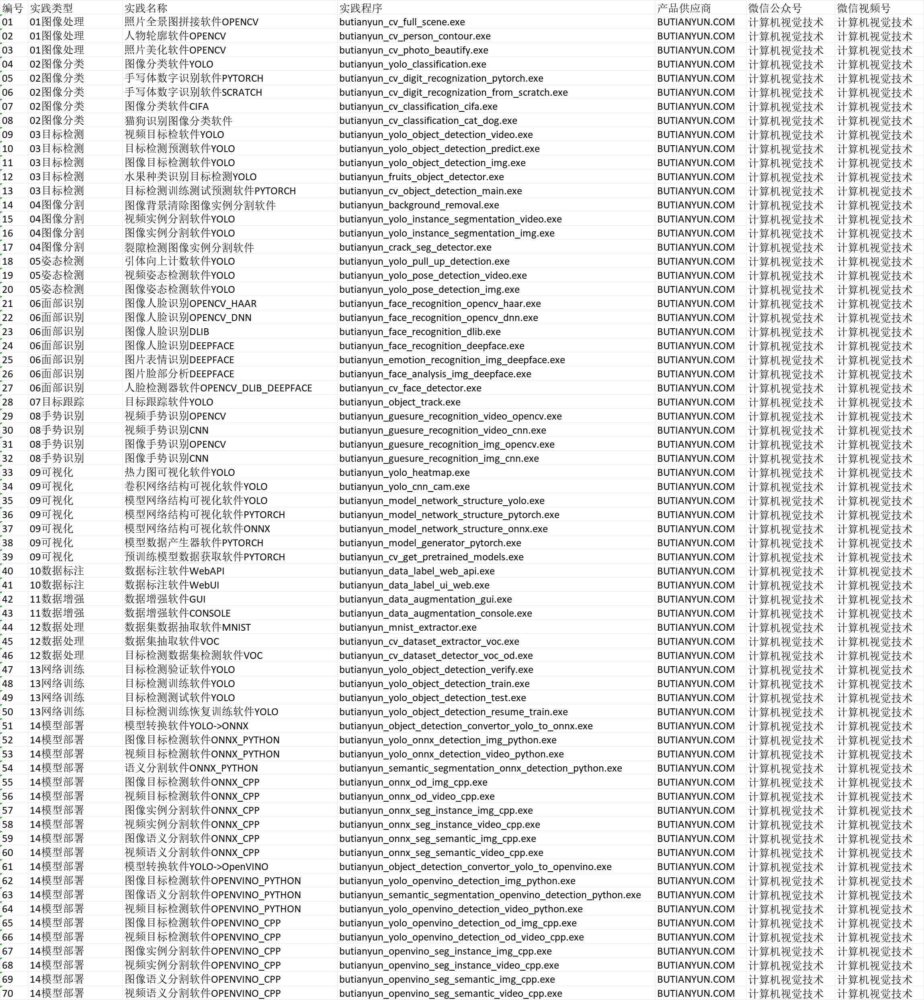
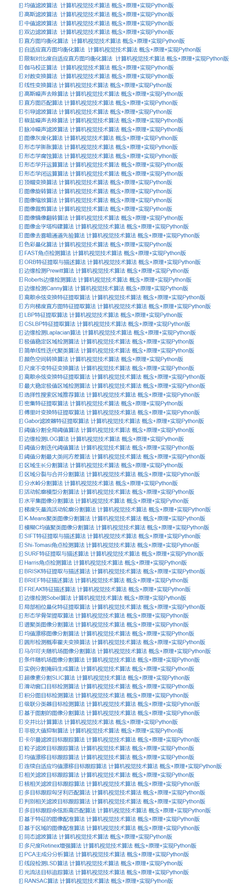
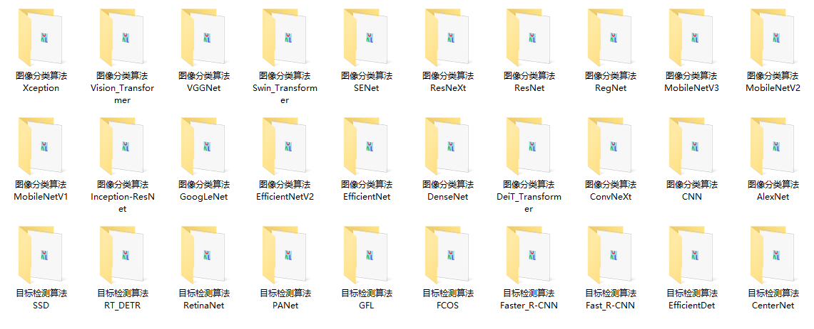

# 视觉技术应用课程实践体系

## 视觉技术应用课程实践A系列应用实践

## 视觉技术应用课程实践B系列传统算法

## 视觉技术应用课程实践C系列网络算法

---

## 软件供应商

计算机视觉技术算法 概念+原理+实现

微信视频号：计算机视觉技术

微信公众号：计算机视觉技术

- 视觉技术算法合集

- 微信视频号

- 微信公众号

- 邮箱

[butianyun_cv@sina.cn](mailto:butianyun_cv@sina.cn)

